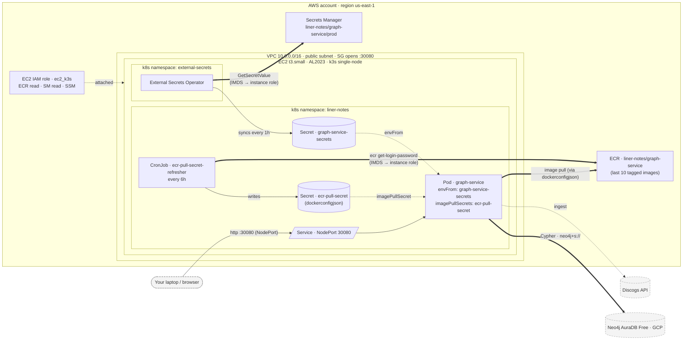

# liner-notes

A personal, open-source, forkable monorepo for exploring a vinyl record collection through a graph database. Your record collection is not a flat list — it is a deeply interconnected web of artists, musicians, studios, labels, eras, and sounds. **liner-notes** pulls a [Discogs](https://www.discogs.com) collection into [Neo4j](https://neo4j.com) and exposes a REST API for rich, relationship-driven exploration: "Who played bass on this record?", "What else was recorded at that studio?", "Which artists appear across the most records in my collection?"

## Services

| Service       | Path                      | Description                                 |
| ------------- | ------------------------- | ------------------------------------------- |
| graph-service | `services/graph-service/` | Fastify REST API + Neo4j ingestion pipeline |

## Quick Start

```bash
# 1. Clone (replace yourusername with your fork, or macamp0328 for the origin)
git clone https://github.com/yourusername/liner-notes.git
cd liner-notes

# 2. Configure
cp .env.example .env.local
# Edit .env.local — set DISCOGS_USERNAME, DISCOGS_TOKEN, NEO4J_URI, NEO4J_USER, NEO4J_PASSWORD, ADMIN_TOKEN

# 3. Install tools and dependencies
mise install  # installs Node, pnpm, and all other pinned tools
pnpm install  # installs JS dependencies

# 4. Start services
docker-compose up

# 5. API and docs
open http://localhost:3000/api/v1/health
open http://localhost:3000/api/docs
```

## Requirements

- [mise](https://mise.jdx.dev) — manages Node.js, pnpm, terraform, kubectl, helm, gh, and aws-cli at the versions pinned in `.mise.toml`. Install once with `brew install mise`, then `mise install` from the repo root.
- Docker Desktop — for local Neo4j via `docker-compose up`
- A [Discogs personal access token](https://www.discogs.com/settings/developers)
- Neo4j — `docker-compose up` starts a local instance automatically. A [Neo4j Aura Free](https://console.neo4j.io) instance is only needed for production deployment.

## Fork & Run Your Own Collection

See the [Fork Guide](liner-notes-spec-v0.5.md#16-fork-guide) for step-by-step instructions to run this with your own Discogs collection.

## Architecture

The production deployment is a single-node k3s cluster on EC2, with [Neo4j AuraDB Free](https://console.neo4j.io) as the managed graph database and a small set of AWS services (ECR, Secrets Manager, CloudWatch) providing operational glue.

<!-- diagrams:request-flow:start -->



<!-- diagrams:request-flow:end -->

The diagram above is the **logical request flow** — what talks to what at runtime.

Below is the **raw Terraform resource graph**, auto-generated by Inframap from every `.tf` file under `infra/terraform/`. It's the literal dependency tree the cloud provisioner walks:


For per-file Mermaid diagrams showing what each `.tf` file declares and which other files it references, see [`infra/diagrams/per-file/`](infra/diagrams/per-file/) — one diagram per file, useful for understanding a single resource group in isolation.

All diagrams under `infra/diagrams/` are regenerated by `pnpm diagrams:generate` (locally) or by the [`diagrams.yml` workflow](.github/workflows/diagrams.yml) on any PR that touches `infra/terraform/**`. The hand-maintained logical flow lives in [`infra/diagrams/request-flow.mmd`](infra/diagrams/request-flow.mmd) — edit it there and re-run the generator to update both this README and the [operator runbook](infra/RUNBOOK.md).

Local install for the generator: `brew install inframap graphviz` on macOS. CI uses `go install github.com/cycloidio/inframap/cmd/inframap@latest` plus `apt-get install graphviz`.

## Stack

- **Runtime:** Node.js v22.x + TypeScript (strict)
- **Framework:** Fastify v5
- **Database:** Neo4j (Aura Free)
- **Package manager:** pnpm workspaces
- **Module system:** ESM — `"type": "module"` on all services, `module: NodeNext` in tsconfig. All local/relative imports use `.js` extensions (enforced by the TypeScript compiler). This keeps the module format, the TypeScript config, and the runtime all aligned.
- **Testing:** Vitest
- **Infrastructure:** k3s on EC2 t3.micro, AWS ECR, AWS Secrets Manager

## License

MIT — see [LICENSE](LICENSE).
