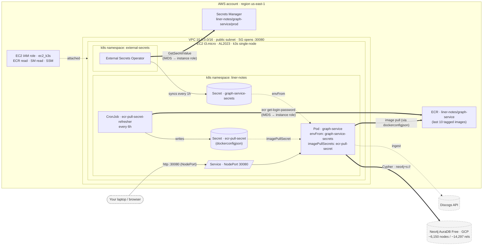

# Production Runbook — graph-service on AWS

This is the operator's guide to standing up, redeploying, and recovering the production environment for `liner-notes`. The architecture is summarized in the root [CLAUDE.md](../CLAUDE.md) under "Deployment Overview"; this file covers the _operations_.

- [Architecture at a glance](#architecture-at-a-glance)
- [Prerequisites](#prerequisites)
- [First-time deploy — step by step](#first-time-deploy--step-by-step)
- [Redeploy procedure](#redeploy-procedure)
- [Resuming a paused Aura instance](#resuming-a-paused-aura-instance)
- [Where to look when things break](#where-to-look-when-things-break)
- [Tear-down](#tear-down)

---

## Architecture at a glance



**Key flows:**

- **Secrets**: AWS Secrets Manager → External Secrets Operator → k8s `Secret` → pod env. ESO authenticates via the EC2 instance role through IMDS — no static AWS keys live in the cluster.
- **Image pulls**: a CronJob mints a fresh 12h ECR auth token every 6h using the same instance role, writes it into `Secret/ecr-pull-secret`, and the Deployment references it via `imagePullSecrets`. Plain k3s/containerd doesn't speak IAM directly, so this k8s-native loop fills the gap.
- **Ingress**: NodePort `:30080`, opened to the world (or to a narrowed CIDR) by the EC2 security group. Read endpoints are public; mutating endpoints require `ADMIN_TOKEN`.
- **Graph data**: Aura Free in GCP. Cross-cloud Cypher latency is ~tens of ms — acceptable for this workload.

---

## Prerequisites

On your laptop:

| Tool                     | Why                                                                           |
| ------------------------ | ----------------------------------------------------------------------------- |
| AWS CLI                  | Configure with credentials that can manage VPC / EC2 / IAM / ECR / SM         |
| `terraform`              | `>= 1.5` — pinned in `.mise.toml`                                             |
| `kubectl`                | `>= 1.30`                                                                     |
| `kustomize`              | bundled with recent `kubectl` (`kubectl kustomize`) — standalone is also fine |
| `docker`                 | for building the image                                                        |
| `helm`                   | `>= 3.10`, used once to install External Secrets Operator                     |
| `session-manager-plugin` | for `aws ssm start-session` (optional but recommended over SSH)               |

Credentials to have on hand:

- **Aura** — `NEO4J_URI` (`neo4j+s://…databases.neo4j.io`), `NEO4J_USER`, `NEO4J_PASSWORD` from [console.neo4j.io](https://console.neo4j.io).
- **Discogs** — your username + a personal access token.
- A random **`ADMIN_TOKEN`** — generate with `openssl rand -hex 32`.

---

## First-time deploy — step by step

> **Where commands run:**
> Steps 1–4 run on **your laptop**. Step 5 runs **on the EC2 node** (via Session Manager). Steps 6–8 run **on your laptop again** with `KUBECONFIG` pointed at the node — see below.
>
> Every shell variable set in one step (`ECR_URL`, `REGION`, `INSTANCE_ID`, etc.) is reused in later steps; keep the same terminal open or re-export them.

### Step 1 — Apply Terraform

From the repo root:

```bash
cd infra/terraform
terraform init
terraform apply         # type `yes` to confirm
```

Capture the outputs for later steps:

```bash
export REGION=$(terraform output -raw aws_region 2>/dev/null || echo us-east-1)
export ECR_URL=$(terraform output -raw ecr_repository_url)
export INSTANCE_ID=$(terraform output -raw ec2_instance_id)
export PUBLIC_DNS=$(terraform output -raw ec2_public_dns)
export SERVICE_URL=$(terraform output -raw service_url)
```

**Expected:** ~3 minutes. Outputs printed at the end. EC2 user_data continues installing k3s + helm for another ~2 minutes after the instance comes up.

### Step 2 — Populate AWS Secrets Manager

Terraform created the secret container but **not** the value. Populate it once. `MUSICBRAINZ_USER_AGENT` is mandatory — without it the MusicBrainz / VIAF / Wikidata enrichment endpoints return 503.

```bash
aws secretsmanager put-secret-value \
  --region "$REGION" \
  --secret-id liner-notes/graph-service/prod \
  --secret-string "$(cat <<'EOF'
{
  "NEO4J_URI": "neo4j+s://<your-aura-id>.databases.neo4j.io",
  "NEO4J_USER": "neo4j",
  "NEO4J_PASSWORD": "<your-aura-password>",
  "DISCOGS_USERNAME": "<your-discogs-username>",
  "DISCOGS_TOKEN": "<your-discogs-token>",
  "DISCOGS_USER_AGENT": "liner-notes/1.0 +https://github.com/macamp0328/liner-notes",
  "MUSICBRAINZ_USER_AGENT": "liner-notes/1.0 +https://github.com/macamp0328/liner-notes",
  "ADMIN_TOKEN": "<your-generated-random-token>"
}
EOF
)"
```

Add `GENIUS_TOKEN` to the JSON for lyrics enrichment; `ACOUSTICBRAINZ_USER_AGENT` is optional.

> **Why this isn't in Terraform:** keeping the value out of state means the Aura password isn't readable from `terraform.tfstate`, and rotation is one CLI call away — no Terraform run needed.

### Step 3 — Build and push the first image

From the repo root:

```bash
cd "$(git rev-parse --show-toplevel)"
export TAG=$(git rev-parse --short HEAD)

aws ecr get-login-password --region "$REGION" \
  | docker login --username AWS --password-stdin "$ECR_URL"

docker build \
  -f services/graph-service/Dockerfile \
  -t "$ECR_URL:$TAG" \
  .

docker push "$ECR_URL:$TAG"
```

**Expected:** first build ~2–4 minutes; push ~30s.

### Step 4 — Pull the k3s kubeconfig down to your laptop

Open a Session Manager shell to the node and grab the kubeconfig:

```bash
aws ssm start-session --region "$REGION" --target "$INSTANCE_ID"
# inside the session:
sudo cat /etc/rancher/k3s/k3s.yaml
exit
```

Paste the YAML into a local file, swap `127.0.0.1` for the public DNS, and use it:

```bash
mkdir -p ~/.kube
# paste the YAML you copied into ~/.kube/liner-notes-prod.yaml, then:
sed -i.bak "s/127.0.0.1/$PUBLIC_DNS/" ~/.kube/liner-notes-prod.yaml
export KUBECONFIG=~/.kube/liner-notes-prod.yaml

kubectl get nodes   # should show one Ready node
```

> The k3s API listens on `:6443`. The EC2 security group does **not** open `:6443` by default. To run `kubectl` from your laptop, narrow `allow_app_cidr` in tfvars to your IP and add a port-6443 rule in `infra/terraform/networking.tf`, **or** keep all `kubectl` work inside the SSM shell. The instructions below use `KUBECONFIG` from the laptop — flip them onto the SSM shell if you prefer.

### Step 5 — Install External Secrets Operator (one-time)

```bash
helm repo add external-secrets https://charts.external-secrets.io
helm repo update

helm install external-secrets external-secrets/external-secrets \
  --namespace external-secrets \
  --create-namespace \
  --set installCRDs=true

kubectl -n external-secrets rollout status deployment/external-secrets-webhook
```

**Expected:** ~1 minute. The `rollout status` wait is important — applying the `ClusterSecretStore` before the webhook is ready returns a webhook-timeout error.

### Step 6 — Bootstrap the ECR pull secret

The CronJob can't run before its own manifest exists, so for the very first pull we create the secret by hand. After this, the CronJob takes over and refreshes it every 6 hours.

```bash
kubectl apply -f infra/k8s/namespace.yaml

kubectl -n liner-notes create secret docker-registry ecr-pull-secret \
  --docker-server="$ECR_URL" \
  --docker-username=AWS \
  --docker-password="$(aws ecr get-login-password --region "$REGION")"
```

### Step 7 — Apply the application manifests

Two one-time edits before applying, then apply:

```bash
cd infra/k8s/graph-service

# 7a. If you applied Terraform with a non-default region, retarget the
#     ClusterSecretStore and the CronJob's AWS_REGION to match.
if [ "$REGION" != "us-east-1" ]; then
  sed -i.bak "s/us-east-1/$REGION/g" external-secret.yaml ecr-pull-secret-refresher.yaml
fi

# 7b. Tell the CronJob which ECR hostname to write into the dockerconfigjson.
sed -i.bak "s|value: REPLACE_ME|value: $ECR_URL|" ecr-pull-secret-refresher.yaml

# 7c. Point the Deployment at the image you just pushed.
kustomize edit set image "graph-service-image=$ECR_URL:$TAG"

# 7d. Apply everything (Deployment, Service, ExternalSecret, CronJob + RBAC).
kubectl apply -k .
cd "$(git rev-parse --show-toplevel)"
```

**Expected:** all four resources show `created`. The pod takes ~30s to pull the image and start.

### Step 8 — Verify

```bash
# Pod is Running and Ready
kubectl -n liner-notes get pods

# ExternalSecret status is "SecretSynced"
kubectl -n liner-notes get externalsecret graph-service-secrets

# Health endpoint returns 200 from the public DNS
curl "$SERVICE_URL/api/v1/health"
# Expected: {"status":"ok","neo4j":"connected"}
```

The empty-graph auto-ingest fires on first boot:

```bash
kubectl -n liner-notes logs deployment/graph-service -f
```

**Expected:** ~4 minutes for ~6,150 nodes and ~14,297 relationships. You'll see `Graph is empty — starting Discogs ingestion in background` followed by progress logs.

---

## Redeploy procedure

```bash
export TAG=$(git rev-parse --short HEAD)

aws ecr get-login-password --region "$REGION" \
  | docker login --username AWS --password-stdin "$ECR_URL"

docker build -f services/graph-service/Dockerfile -t "$ECR_URL:$TAG" .
docker push "$ECR_URL:$TAG"

cd infra/k8s/graph-service
kustomize edit set image "graph-service-image=$ECR_URL:$TAG"
kubectl apply -k .
kubectl -n liner-notes rollout status deployment/graph-service
cd "$(git rev-parse --show-toplevel)"
```

The Deployment uses `strategy: Recreate` — there will be ~30 seconds of downtime while the old pod terminates and the new one starts. Acceptable for a personal-project prod; a multi-AZ HA setup is out of scope.

---

## Resuming a paused Aura instance

AuraDB Free auto-pauses after **72 hours of inactivity**. Traffic does **not** auto-resume a paused instance.

1. Sign in to [console.neo4j.io](https://console.neo4j.io)
2. Open the project, click the paused instance, click **Resume**
3. Wait ~30 seconds for the instance to come back online
4. Restart graph-service pods so the driver reconnects cleanly:
   ```bash
   kubectl -n liner-notes rollout restart deployment/graph-service
   ```

A scheduled keep-warm ping is tracked in [#103](https://github.com/macamp0328/liner-notes/issues/103).

---

## Where to look when things break

| Symptom                                                        | First thing to check                                                                                                                                                                                                                                        |
| -------------------------------------------------------------- | ----------------------------------------------------------------------------------------------------------------------------------------------------------------------------------------------------------------------------------------------------------- |
| Pod stuck in `CrashLoopBackOff` on first deploy                | `kubectl -n liner-notes describe externalsecret graph-service-secrets` — if `SecretSyncedError`, the AWS secret value isn't populated (step 2) or the instance role is missing `secretsmanager:GetSecretValue`.                                             |
| Pod restarts every ~minute                                     | `kubectl -n liner-notes logs deployment/graph-service` — usually Neo4j: Aura paused, wrong `NEO4J_URI`, or a transient network blip.                                                                                                                        |
| `503` from `/api/v1/health` with `neo4j: disconnected`         | Aura paused — see "Resuming a paused Aura instance".                                                                                                                                                                                                        |
| `ExternalSecret` perpetually `SecretSyncedError: AccessDenied` | EC2 instance role is missing Secrets Manager read; verify `aws_iam_role_policy.secrets_read` in `infra/terraform/iam.tf` references the correct secret ARN.                                                                                                 |
| `ImagePullBackOff`                                             | `kubectl -n liner-notes get secret ecr-pull-secret` — if missing or older than 12h, re-run step 6 and force the refresher: `kubectl -n liner-notes create job --from=cronjob/ecr-pull-secret-refresher refresh-now`. Then `rollout restart` the Deployment. |
| Health endpoint unreachable from the internet                  | EC2 security group: `aws_vpc_security_group_ingress_rule.app_nodeport` must allow your IP on `:30080`.                                                                                                                                                      |
| `kubectl` from laptop hangs / times out                        | `:6443` isn't open in the security group by default. Either run `kubectl` from the SSM session, or extend the SG. Don't open `:6443` to the world — narrow to your IP.                                                                                      |
| k3s itself unhealthy                                           | In an SSM session: `sudo journalctl -u k3s -n 200`, `sudo systemctl status k3s`.                                                                                                                                                                            |
| Refresher CronJob failing                                      | `kubectl -n liner-notes logs job/<latest-refresher-job>` — typical failures are IMDS unreachable (pod has lost connectivity) or `ECR_REGISTRY=REPLACE_ME` (step 7b skipped).                                                                                |

---

## Tear-down

```bash
cd infra/terraform
terraform destroy        # type `yes` to confirm
```

This deletes the EC2 instance, VPC, ECR repository (and all images — the repo is created with `force_delete = true`), IAM roles, and the Secrets Manager secret container. The Aura instance is **not** managed by Terraform — leave it alone if you want to keep the graph data.

> The Secrets Manager secret enters a 30-day recovery window after destroy; re-applying within 30 days hits `InvalidRequestException`. Either `aws secretsmanager delete-secret --force-delete-without-recovery` before re-applying, or wait it out.
