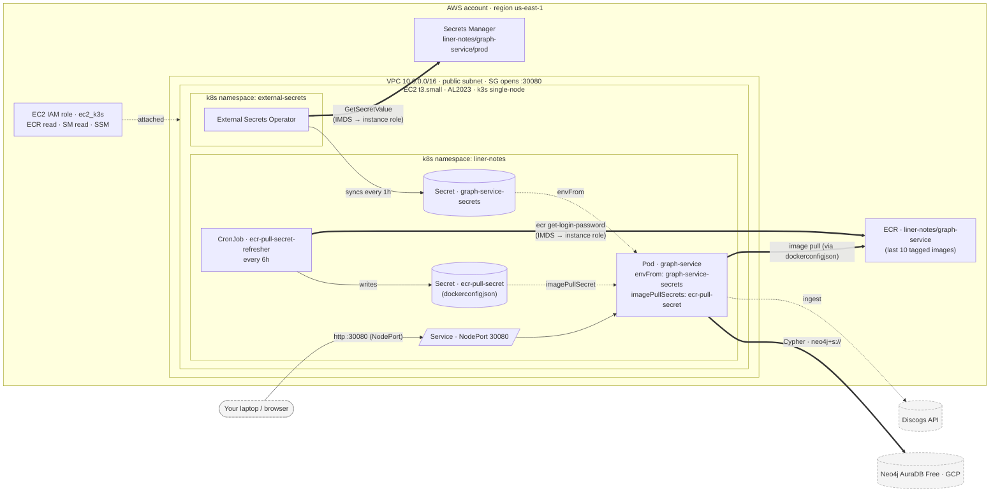

# Production Runbook — graph-service on AWS

This is the operator's guide to standing up, redeploying, and recovering the production environment for `liner-notes`. The architecture is summarized in the root [CLAUDE.md](../CLAUDE.md) under "Deployment Overview"; this file covers the _operations_.

- [Architecture at a glance](#architecture-at-a-glance)
- [Prerequisites](#prerequisites)
- [First-time deploy — step by step](#first-time-deploy--step-by-step)
- [Observability — fluent-bit and alarms](#observability--fluent-bit-and-alarms)
- [Redeploy procedure](#redeploy-procedure)
- [Resuming a paused Aura instance](#resuming-a-paused-aura-instance)
- [Where to look when things break](#where-to-look-when-things-break)
- [Tear-down](#tear-down)

---

## Architecture at a glance

<!-- diagrams:request-flow:start -->



<!-- diagrams:request-flow:end -->

> **Source of truth:** [`infra/diagrams/request-flow.mmd`](diagrams/request-flow.mmd). Regenerate with `pnpm diagrams:generate` after editing. A full Terraform resource graph (auto-generated) lives at [`diagrams/resource-graph.svg`](diagrams/resource-graph.svg); per-file Mermaid diagrams are under [`diagrams/per-file/`](diagrams/per-file/).

**Key flows:**

- **Secrets**: AWS Secrets Manager → External Secrets Operator → k8s `Secret` → pod env. ESO authenticates via the EC2 instance role through IMDS — no static AWS keys live in the cluster.
- **Image pulls**: a CronJob mints a fresh 12h ECR auth token every 6h using the same instance role, writes it into `Secret/ecr-pull-secret`, and the Deployment references it via `imagePullSecrets`. Plain k3s/containerd doesn't speak IAM directly, so this k8s-native loop fills the gap.
- **Ingress**: NodePort `:30080`, opened to the world (or to a narrowed CIDR) by the EC2 security group. Read endpoints are public; mutating endpoints require `ADMIN_TOKEN`.
- **Graph data**: Aura Free in GCP. Cross-cloud Cypher latency is ~tens of ms — acceptable for this workload.

---

## Prerequisites

### Tooling on your laptop

All mandatory. Install via Homebrew on macOS (or your package manager of choice):

```bash
brew install mise              # runtime version manager — pins the toolchain per .mise.toml below
brew install kustomize         # k8s/kubectl bundles a `kustomize` subcommand but not `kustomize edit`
brew install jq                # for validating the Secrets Manager JSON before submitting
brew install --cask session-manager-plugin   # required for every `aws ssm` command
```

Then from the repo root, install the mise-managed tools (`terraform`, `kubectl`, `helm`, `gh`, `aws-cli`, `node`, `pnpm`):

```bash
mise install
```

| Tool                     | Why                                                                                      |
| ------------------------ | ---------------------------------------------------------------------------------------- |
| `aws` CLI                | Manage VPC / EC2 / IAM / ECR / Secrets Manager / SSM                                     |
| `terraform`              | `>= 1.5` — pinned in `.mise.toml`                                                        |
| `kubectl`                | `>= 1.30` — pinned in `.mise.toml`                                                       |
| `kustomize`              | Standalone — `kubectl kustomize` doesn't include the `edit` subcommand the runbook needs |
| `docker`                 | Build the container image (Docker Desktop on macOS)                                      |
| `helm`                   | `>= 3.10` — one-time install of External Secrets Operator                                |
| `jq`                     | Validate the Secrets Manager JSON before pushing it                                      |
| `session-manager-plugin` | Required by every `aws ssm start-session` invocation                                     |
| `mise`                   | Pins the toolchain versions in `.mise.toml`                                              |

### AWS credentials

The runbook assumes a non-root IAM user (`liner-notes-cli` in our setup) with the following:

- `AmazonEC2FullAccess` (from initial setup)
- `AmazonEC2ContainerRegistryFullAccess` (from initial setup)
- `SecretsManagerReadWrite` (from initial setup)
- **Inline policy** from [`infra/iam/operator-iam-policy.json`](iam/operator-iam-policy.json) — Terraform-managed IAM roles, CloudWatch logs + alarms, SNS topic + subscription, Route 53 health checks
- **Inline policy** from [`infra/iam/operator-ssm-policy.json`](iam/operator-ssm-policy.json) — SSM Session Manager

See [`infra/iam/README.md`](iam/README.md) for the one-time attach procedure. **Do this before Step 1** or `terraform apply` and the `aws ssm` calls will fail with `AccessDenied`.

### Credentials to have on hand

- **Aura** — `NEO4J_URI` (`neo4j+s://…databases.neo4j.io`), `NEO4J_USER`, `NEO4J_PASSWORD` from [console.neo4j.io](https://console.neo4j.io).
- **Discogs** — your username + a personal access token.
- A random **`ADMIN_TOKEN`** — generate with `openssl rand -hex 32`.

---

## First-time deploy — step by step

> **Where commands run:** every step in this section runs on **your laptop** except a few minutes inside Step 5, which open an interactive SSM session on the EC2 node. Step 4 opens a Session Manager port-forward in a second terminal that stays running for Steps 6–8.
>
> **Shell variables carry between steps.** Set `REGION`, `ECR_URL`, `ECR_REGISTRY`, `INSTANCE_ID`, `PUBLIC_DNS`, `SERVICE_URL`, `TAG`, `KUBECONFIG` once in Step 1 / Step 3 / Step 4 — keep the same terminal open or re-export them.

### Step 1 — Apply Terraform

From the repo root:

```bash
cd infra/terraform
terraform init
terraform apply         # type `yes` to confirm
```

Capture the outputs for later steps:

```bash
export REGION=$(terraform output -raw aws_region)
export ECR_URL=$(terraform output -raw ecr_repository_url)
export ECR_REGISTRY="${ECR_URL%%/*}"          # registry hostname only (strip the repo path)
export INSTANCE_ID=$(terraform output -raw ec2_instance_id)
export PUBLIC_DNS=$(terraform output -raw ec2_public_dns)
export SERVICE_URL=$(terraform output -raw service_url)

# Sanity — every line should print non-empty
for v in REGION ECR_URL ECR_REGISTRY INSTANCE_ID PUBLIC_DNS SERVICE_URL; do
  printf "%-14s = %s\n" "$v" "$(eval echo \$$v)"
done

cd "$(git rev-parse --show-toplevel)"
```

**Expected:** ~3 minutes for the apply. EC2 user_data continues installing k3s + helm on the node for another ~2 minutes after the instance comes up.

> **EIP IP-swap on first apply.** `aws_eip.k3s` (added in [#125](https://github.com/macamp0328/liner-notes/pull/125)) replaces the instance's auto-assigned public IP with a stable Elastic IP. On the very first `terraform apply` against an existing instance, the public IP changes — re-fetch `PUBLIC_DNS` / `SERVICE_URL` (the export block above does this), and refresh any browser bookmarks pointed at the old address. After that, the EIP is permanent across stop/start cycles.

### Step 2 — Populate AWS Secrets Manager

Terraform created the secret _container_ but **not** the value. Populate it once. `MUSICBRAINZ_USER_AGENT` is mandatory — without it the MusicBrainz / VIAF / Wikidata enrichment endpoints return 503.

Build the JSON in a shell variable so you can validate it with `jq` before sending — malformed JSON here is by far the most common cause of `ExternalSecret SecretSyncedError` later:

```bash
SECRET_JSON='{
  "NEO4J_URI":            "neo4j+s://<your-aura-id>.databases.neo4j.io",
  "NEO4J_USER":           "neo4j",
  "NEO4J_PASSWORD":       "<your-aura-password>",
  "DISCOGS_USERNAME":     "<your-discogs-username>",
  "DISCOGS_TOKEN":        "<your-discogs-token>",
  "DISCOGS_USER_AGENT":   "liner-notes/1.0 +https://github.com/macamp0328/liner-notes",
  "MUSICBRAINZ_USER_AGENT": "liner-notes/1.0 +https://github.com/macamp0328/liner-notes",
  "ADMIN_TOKEN":          "<your-generated-random-token>"
}'

# Validate first — if jq accepts it, AWS will too
echo "$SECRET_JSON" | jq .

# Push the value to AWS Secrets Manager
aws secretsmanager put-secret-value \
  --region "$REGION" \
  --secret-id liner-notes/graph-service/prod \
  --secret-string "$SECRET_JSON"
```

Add `GENIUS_TOKEN` to the JSON for lyrics enrichment; `ACOUSTICBRAINZ_USER_AGENT` is optional.

> **Why this isn't in Terraform:** keeping the value out of state means the Aura password isn't readable from `terraform.tfstate`, and rotation is one CLI call away — no Terraform run needed.

### Step 3 — Build and push the first image

```bash
export TAG=$(git rev-parse --short HEAD)

aws ecr get-login-password --region "$REGION" \
  | docker login --username AWS --password-stdin "$ECR_URL"

docker buildx build \
  --platform linux/amd64 \
  -f services/graph-service/Dockerfile \
  -t "$ECR_URL:$TAG" \
  --push \
  .
```

**`--platform linux/amd64` is mandatory if you're on an Apple Silicon Mac.** `docker build` without the flag defaults to your host architecture (`linux/arm64` on M1/M2/M3/M4), and the EC2 instance is `linux/amd64` — the pod will fail with `no match for platform in manifest: not found` if you skip this.

`buildx ... --push` builds and pushes in one shot. Expected: ~2–4 minutes for a clean build, ~30s on cached re-runs.

### Step 4 — Get a kubeconfig pointed at the k3s API via SSM port-forward

The k3s API server listens on `:6443`. We don't open that port in the security group — instead we tunnel through SSM, which keeps the API private and avoids the TLS-SAN problem (k3s only signs its API cert for `127.0.0.1` / the node's local IPs unless told otherwise, so connecting to `$PUBLIC_DNS:6443` would fail certificate verification).

**4a. Grab the kubeconfig:**

```bash
mkdir -p ~/.kube
aws ssm start-session --region "$REGION" --target "$INSTANCE_ID" \
  --document-name AWS-StartInteractiveCommand \
  --parameters 'command=["sudo cat /etc/rancher/k3s/k3s.yaml"]' \
  > ~/.kube/liner-notes-prod.yaml

# Trim the SSM banner lines if present (first line "Starting session..." and
# trailing "Exiting session..."). Open the file in your editor and ensure the
# first non-empty line is `apiVersion: v1` and the last is the user's
# `client-key-data:` value.

export KUBECONFIG=~/.kube/liner-notes-prod.yaml
```

The kubeconfig points at `https://127.0.0.1:6443` — leave it that way. The k3s API cert is valid for `127.0.0.1`, and the port-forward below makes that local address reach the node.

**4b. Open a port-forward in a separate terminal** and leave it running for the rest of the deploy:

```bash
# In a NEW terminal — keep this open for Steps 6–8.
aws ssm start-session --region "$REGION" --target "$INSTANCE_ID" \
  --document-name AWS-StartPortForwardingSession \
  --parameters '{"portNumber":["6443"],"localPortNumber":["6443"]}'
```

**4c. Sanity-check the tunnel:**

```bash
nc -zv 127.0.0.1 6443                    # "succeeded"
curl -sk https://127.0.0.1:6443/livez    # "ok" (401 if you've never auth'd — also fine, means TLS is good)
```

### Step 5 — Install External Secrets Operator (on the node, not via the tunnel)

`helm install` fires ~8 concurrent API calls during install. The SSM port-forward can't carry that level of parallelism reliably — you'll see `TLS handshake timeout` and `client connection lost` errors. Solution: install helm on the node itself, where the k3s API is local with zero network indirection.

Open an **interactive** SSM session (separate from the port-forward; the default per-instance limit is 2 concurrent sessions, both fit):

```bash
aws ssm start-session --region "$REGION" --target "$INSTANCE_ID"
```

You'll get a `sh-5.2$` prompt as `ssm-user`. Inside the session:

```bash
sudo -i -u ec2-user                              # switch to the user that owns ~/.kube/config
export KUBECONFIG=~/.kube/config

# Sanity — should print one Ready node
kubectl get nodes

# Install ESO directly on the node — fast and reliable
helm repo add external-secrets https://charts.external-secrets.io
helm repo update

helm install external-secrets external-secrets/external-secrets \
  --namespace external-secrets \
  --create-namespace \
  --set installCRDs=true \
  --wait --timeout 5m

# Verify
kubectl get pods -n external-secrets
```

**Expected:** ~1 minute. Three pods Running `1/1`: `external-secrets`, `external-secrets-webhook`, `external-secrets-cert-controller`. Then `exit` twice (once to leave `ec2-user`, once to leave the SSM session) — you're back on your laptop.

### Step 6 — Bootstrap the ECR pull secret

Run from your laptop with `KUBECONFIG` set and the Step 4b port-forward still running. The CronJob can't run before its own manifest exists, so we create the first pull secret by hand. After this, the CronJob takes over and refreshes it every 6 hours.

`ECR_REGISTRY` was exported in Step 1 — `docker-server` wants the registry hostname only, not the repo path:

```bash
kubectl apply -f infra/k8s/namespace.yaml

kubectl -n liner-notes create secret docker-registry ecr-pull-secret \
  --docker-server="$ECR_REGISTRY" \
  --docker-username=AWS \
  --docker-password="$(aws ecr get-login-password --region "$REGION")"

kubectl get secret -n liner-notes ecr-pull-secret    # should print "ecr-pull-secret  kubernetes.io/dockerconfigjson"
```

### Step 7 — Apply the application manifests

Still on your laptop, port-forward still running. Two one-time edits to the checked-in manifests, then apply with kustomize:

```bash
cd infra/k8s/graph-service

# 7a. If you applied Terraform with a non-default region, retarget the
#     ClusterSecretStore and the CronJob's AWS_REGION to match.
if [ "$REGION" != "us-east-1" ]; then
  sed -i.bak "s/us-east-1/$REGION/g" external-secret.yaml ecr-pull-secret-refresher.yaml
fi

# 7b. Tell the CronJob which ECR hostname to write into the dockerconfigjson.
sed -i.bak "s|value: REPLACE_ME|value: $ECR_REGISTRY|" ecr-pull-secret-refresher.yaml

# 7c. Point the Deployment at the image you just pushed.
kustomize edit set image "graph-service-image=$ECR_URL:$TAG"

# 7d. Apply everything: ServiceAccount/Role/RoleBinding/CronJob/Service/Deployment/ClusterSecretStore/ExternalSecret.
kubectl apply -k .

cd "$(git rev-parse --show-toplevel)"
```

**Expected:** ~8 lines of `<resource> created`. The pod takes ~30s to pull the image and start.

> **About the working-tree changes:** the `sed` and `kustomize edit` commands modify checked-in files. They're deploy-time overrides — **don't commit them**. After the deploy succeeds, restore the originals:
>
> ```bash
> git restore infra/k8s/graph-service/{external-secret,ecr-pull-secret-refresher,kustomization}.yaml
> rm -f infra/k8s/graph-service/*.bak
> ```

### Step 8 — Verify

Run from your laptop. `kubectl` calls need the Step 4b port-forward; `curl` reaches the service over the public internet on `:30080` (different port from the k3s API).

```bash
# Pod is Running and Ready
kubectl -n liner-notes get pods

# ExternalSecret status is "SecretSynced"
kubectl -n liner-notes get externalsecret graph-service-secrets

# Health endpoint returns 200 from the public DNS
curl -sS "$SERVICE_URL/api/v1/health"
# Expected: {"status":"ok","neo4j":"connected"}
```

The empty-graph auto-ingest fires on first boot:

```bash
kubectl -n liner-notes logs deployment/graph-service -f
```

**Expected:** progress logs starting with `Graph is empty — starting Discogs ingestion in background`. For the project's ~30-record reference collection that ends up around ~6,150 nodes and ~14,297 relationships, the base ingest takes ~4 minutes. Enrichment passes (lyrics, MusicBrainz, AcousticBrainz, Deezer) then run for longer in the background — watch for `Ingestion complete` followed by per-enrichment progress lines.

Spot-check the real data:

```bash
curl -sS "$SERVICE_URL/api/v1/releases?limit=3" | jq .
```

---

## Observability — fluent-bit and alarms

`terraform apply` (Step 1) created the supporting AWS resources for observability: a CloudWatch Log Group (`/liner-notes/graph-service`), an SNS topic with an email subscription, a Route 53 health check probing `/api/v1/health`, and three alarms (pod restarts, health-check failures, EC2 status check). This section covers the two manual follow-ups: confirming the SNS subscription and installing the in-cluster fluent-bit daemonset that actually writes logs to the log group.

### Step 9 — Confirm the SNS subscription

After `terraform apply`, AWS sends an `AWS Notification - Subscription Confirmation` email to the address in `infra/terraform/observability.tf` (currently `macamp0328@gmail.com`). Click the confirmation link **once**. Until you do, alarms publish to SNS but no email is delivered.

Verify the subscription is active:

```bash
aws sns list-subscriptions-by-topic \
  --region "$REGION" \
  --topic-arn "$(terraform -chdir=infra/terraform output -raw sns_topic_arn)"
```

The subscription's `SubscriptionArn` should not be the literal string `PendingConfirmation`.

### Step 10 — Install fluent-bit on the node

Same pattern as Step 5 (External Secrets Operator): helm against the local k3s API from an SSM session, not the laptop tunnel. The chart values are checked in at [`infra/k8s/aws-for-fluent-bit/values.yaml`](k8s/aws-for-fluent-bit/values.yaml) and pulled from the repo at apply time — do not paste them into the SSM terminal (Session Manager occasionally collapses newlines in long heredoc pastes, which silently drops sections of the values file).

Open an interactive SSM session:

```bash
aws ssm start-session --region "$REGION" --target "$INSTANCE_ID"
```

Inside the session:

```bash
sudo -i -u ec2-user
export KUBECONFIG=~/.kube/config

helm repo add eks https://aws.github.io/eks-charts
helm repo update

# Pull the values file from the repo. The raw URL is pinned to main so the
# version applied to prod is exactly what's been merged and reviewed.
curl -fsSL https://raw.githubusercontent.com/macamp0328/liner-notes/main/infra/k8s/aws-for-fluent-bit/values.yaml \
  > /tmp/fluent-bit-values.yaml

# Sanity-check the file landed intact — should print >= 50 lines and end
# with the [INPUT] block.
wc -l /tmp/fluent-bit-values.yaml
tail -8 /tmp/fluent-bit-values.yaml

# Resolve the node's region from IMDSv2 so fluent-bit ships to the same
# region terraform created the log group in, even if var.aws_region was
# overridden. The values file's static `region: us-east-1` is a fallback.
IMDS_TOKEN=$(curl -s -X PUT "http://169.254.169.254/latest/api/token" \
  -H "X-aws-ec2-metadata-token-ttl-seconds: 21600")
NODE_REGION=$(curl -s -H "X-aws-ec2-metadata-token: $IMDS_TOKEN" \
  http://169.254.169.254/latest/meta-data/placement/region)

# `--version 0.2.0` pins the chart to the version the values file was
# tested against. The values file re-declares the chart's default volumes
# because v0.2.0 has no extraVolumes/extraVolumeMounts append-style key —
# if the chart's defaults change in a later version, our override would
# silently drop them. Bump both in lockstep.
#
# If you've overridden var.project_name in terraform, also pass:
#   --set cloudWatchLogs.logGroupName=/<your-project-name>/graph-service
helm upgrade --install aws-for-fluent-bit eks/aws-for-fluent-bit \
  --version 0.2.0 \
  --namespace amazon-cloudwatch \
  --create-namespace \
  -f /tmp/fluent-bit-values.yaml \
  --set cloudWatchLogs.region="$NODE_REGION" \
  --wait --timeout 5m

kubectl -n amazon-cloudwatch get pods
```

**Expected:** ~1 minute. One `aws-for-fluent-bit-*` pod per node (just one — single-node k3s) in `Running 1/1`.

**Before leaving the SSM session, confirm the systemd input actually started:**

```bash
kubectl -n amazon-cloudwatch logs -l app.kubernetes.io/name=aws-for-fluent-bit \
  | grep -iE 'systemd|journal' | head -5
```

You should see lines like `[input:systemd:systemd.0]` indicating fluent-bit opened the journal. **Zero matching lines = the values file was applied but the systemd input never initialized** — investigate before continuing. The most common cause is the chart silently ignoring the values block (re-run `wc -l /tmp/fluent-bit-values.yaml` and compare against the repo file).

Then `exit` twice to leave the SSM session.

### Step 11 — Verify logs and alarms

Logs should appear in CloudWatch within ~30 seconds. From your laptop:

```bash
# Confirm BOTH streams are flowing — pod stdout and k3s systemd journal.
# The chart prepends `pod.` to every tag, so the systemd-sourced stream is
# `pod.k3s.k3s.service`, not bare `k3s.*`.
aws logs describe-log-streams \
  --region "$REGION" \
  --log-group-name /liner-notes/graph-service \
  --order-by LastEventTime --descending --max-items 10 \
  --query 'logStreams[].logStreamName' --output table
```

Expect a mix of `pod.kube.var.log.containers.*` streams (one per pod) and a single `pod.k3s.k3s.service` stream. If the `pod.k3s.*` stream is missing, jump back to the verification step in Step 10 — the rest of this section assumes the systemd input is producing data.

```bash
# Tail interleaved
aws logs tail /liner-notes/graph-service --region "$REGION" --since 5m --follow
```

#### Smoke-testing the alarms

The `liner-notes-pod-restarts` metric filter matches the phrases `"Liveness probe failed"` and `"CrashLoopBackOff"` against the `pod.k3s.k3s.service` stream's content. A graceful `kubectl delete pod` produces neither phrase — kubelet just logs the clean shutdown — so the alarm will not fire on that signal. Use a controlled crash-loop induction instead:

```bash
# Step 4b port-forward still running, KUBECONFIG still set. The graph-service
# deployment uses the Helm-style `app.kubernetes.io/name` label, not `app`.

# Patch the deployment so the container exits immediately. Kubelet will hit
# CrashLoopBackOff after a few restarts and log it to the k3s journal.
kubectl -n liner-notes patch deployment graph-service --type=json \
  -p='[{"op":"add","path":"/spec/template/spec/containers/0/command","value":["false"]}]'

# Within ~3 min, "CrashLoopBackOff" should appear in CloudWatch
sleep 180
aws logs filter-log-events --region "$REGION" \
  --log-group-name /liner-notes/graph-service \
  --filter-pattern 'CrashLoopBackOff' --limit 3 \
  --query 'events[].message' --output text | head -5

# Wait the full alarm window (5 min total), then:
sleep 120
aws cloudwatch describe-alarms --region "$REGION" \
  --alarm-names liner-notes-pod-restarts \
  --query 'MetricAlarms[0].StateValue'
# Expect "ALARM" and an SNS email shortly after.

# Revert — restores the deployment's normal command and brings graph-service back up.
kubectl -n liner-notes rollout undo deployment graph-service
kubectl -n liner-notes rollout status deployment graph-service --timeout=2m
```

During the crash-loop induction the `liner-notes-health-check` (Route 53) alarm will also fire — `/api/v1/health` is unreachable while the container is exiting. That doubles as confirmation the external-probe path works. After the revert, both alarms transition back to `OK` over the next few minutes and an `OK` email arrives.

If `liner-notes-pod-restarts` stays `INSUFFICIENT_DATA` even with `CrashLoopBackOff` matches appearing in the log group, the metric filter pattern in [`infra/terraform/observability.tf`](terraform/observability.tf) needs review — the kubelet wording may have shifted between k8s versions.

The Route 53 health check by itself takes ~3–4 minutes from instance stop to email: 3 consecutive 30-second failures (~90s) before the health check flips to unhealthy, then 2 consecutive 1-min alarm periods (~2min) before the alarm fires.

---

## Redeploy procedure

```bash
export TAG=$(git rev-parse --short HEAD)

aws ecr get-login-password --region "$REGION" \
  | docker login --username AWS --password-stdin "$ECR_URL"

docker buildx build \
  --platform linux/amd64 \
  -f services/graph-service/Dockerfile \
  -t "$ECR_URL:$TAG" \
  --push \
  .

cd infra/k8s/graph-service
kustomize edit set image "graph-service-image=$ECR_URL:$TAG"
kubectl apply -k .
kubectl -n liner-notes rollout status deployment/graph-service

# Don't commit the image override
git restore kustomization.yaml
cd "$(git rev-parse --show-toplevel)"
```

The Deployment uses `strategy: Recreate` — there will be ~30 seconds of downtime while the old pod terminates and the new one starts. Acceptable for a personal-project prod; a multi-AZ HA setup is out of scope.

---

## Resuming a paused Aura instance

AuraDB Free auto-pauses after **72 hours of inactivity**. Traffic does **not** auto-resume a paused instance.

1. Sign in to [console.neo4j.io](https://console.neo4j.io)
2. Open the project, click the paused instance, click **Resume**
3. Wait ~30 seconds for the instance to come back online
4. Restart graph-service pods so the driver reconnects cleanly:
   ```bash
   kubectl -n liner-notes rollout restart deployment/graph-service
   ```

A scheduled keep-warm ping is tracked in [#103](https://github.com/macamp0328/liner-notes/issues/103).

---

## Where to look when things break

| Symptom                                                                                                              | First thing to check                                                                                                                                                                                                                                                                                                                                                                                                                                                                                                                                                                           |
| -------------------------------------------------------------------------------------------------------------------- | ---------------------------------------------------------------------------------------------------------------------------------------------------------------------------------------------------------------------------------------------------------------------------------------------------------------------------------------------------------------------------------------------------------------------------------------------------------------------------------------------------------------------------------------------------------------------------------------------- |
| `terraform apply` fails with `AccessDenied` on an IAM resource                                                       | Operator IAM policy from [`infra/iam/operator-iam-policy.json`](iam/operator-iam-policy.json) is not attached. See [`infra/iam/README.md`](iam/README.md).                                                                                                                                                                                                                                                                                                                                                                                                                                     |
| `aws ssm start-session` fails with `not authorized to perform: ssm:StartSession`                                     | Operator SSM policy from [`infra/iam/operator-ssm-policy.json`](iam/operator-ssm-policy.json) is not attached.                                                                                                                                                                                                                                                                                                                                                                                                                                                                                 |
| `aws ssm start-session` fails with `SessionManagerPlugin is not found`                                               | Install with `brew install --cask session-manager-plugin`.                                                                                                                                                                                                                                                                                                                                                                                                                                                                                                                                     |
| `terraform plan` shows `forces replacement` on `aws_instance.k3s` after a successful apply                           | Should not happen — `lifecycle { ignore_changes = [ami] }` is in `ec2.tf` precisely to prevent this. If you see it, check that the lifecycle block is still in place.                                                                                                                                                                                                                                                                                                                                                                                                                          |
| Node OOM, `etcd failed`, load average way over 1× CPU                                                                | t3.micro is undersized — resize to t3.small. With state preserved: `aws ec2 stop-instances`, `aws ec2 modify-instance-attribute --instance-type '{"Value":"t3.small"}'`, `aws ec2 start-instances`. Public IP changes on stop/start without an EIP, so re-export `PUBLIC_DNS` / `SERVICE_URL` after.                                                                                                                                                                                                                                                                                           |
| `ExternalSecret SecretSyncedError: invalid character … after object key`                                             | The JSON in AWS Secrets Manager is malformed. Re-validate locally with `jq` and `put-secret-value` again. Then `kubectl annotate externalsecret -n liner-notes graph-service-secrets force-sync=$(date +%s) --overwrite` to retry immediately.                                                                                                                                                                                                                                                                                                                                                 |
| `ExternalSecret SecretSyncedError: AccessDenied`                                                                     | EC2 instance role is missing Secrets Manager read; verify `aws_iam_role_policy.secrets_read` in `infra/terraform/iam.tf` references the correct secret ARN.                                                                                                                                                                                                                                                                                                                                                                                                                                    |
| `kubectl apply -k .` errors with `no matches for kind "ClusterSecretStore" in version "external-secrets.io/v1beta1"` | The ESO chart you installed has moved past `v1beta1`. Verify with `kubectl api-resources --api-group=external-secrets.io`, update the `apiVersion` in `external-secret.yaml`, re-apply.                                                                                                                                                                                                                                                                                                                                                                                                        |
| Pod `ImagePullBackOff` with `no match for platform in manifest`                                                      | Image was built for the wrong architecture. Rebuild with `docker buildx build --platform linux/amd64 ... --push .` and delete the pod to force re-pull.                                                                                                                                                                                                                                                                                                                                                                                                                                        |
| Pod `ImagePullBackOff` with `unauthorized` / `401`                                                                   | `kubectl -n liner-notes get secret ecr-pull-secret` — if missing or older than 12h, re-run Step 6 and force the refresher: `kubectl -n liner-notes create job --from=cronjob/ecr-pull-secret-refresher refresh-now`. Then `rollout restart` the Deployment.                                                                                                                                                                                                                                                                                                                                    |
| Pod `CrashLoopBackOff` on first deploy                                                                               | `kubectl -n liner-notes describe externalsecret graph-service-secrets` — `SecretSyncedError` means Step 2 didn't land cleanly.                                                                                                                                                                                                                                                                                                                                                                                                                                                                 |
| Pod restarts every ~minute                                                                                           | `kubectl -n liner-notes logs deployment/graph-service` — usually Neo4j: Aura paused, wrong `NEO4J_URI`, or a transient network blip.                                                                                                                                                                                                                                                                                                                                                                                                                                                           |
| `503` from `/api/v1/health` with `neo4j: disconnected`                                                               | Aura paused — see "Resuming a paused Aura instance".                                                                                                                                                                                                                                                                                                                                                                                                                                                                                                                                           |
| Need to read graph-service logs without `kubectl`                                                                    | Logs ship to CloudWatch Log Group `/liner-notes/graph-service` via fluent-bit. Tail with `aws logs tail /liner-notes/graph-service --since 1h --follow`, or browse in the CloudWatch console.                                                                                                                                                                                                                                                                                                                                                                                                  |
| Alarm fires but no email arrives                                                                                     | SNS email subscription wasn't confirmed. Re-check the inbox for the AWS confirmation link, or `aws sns list-subscriptions-by-topic` — a subscription stuck in `PendingConfirmation` doesn't deliver. To re-send: `terraform taint aws_sns_topic_subscription.email && terraform apply`.                                                                                                                                                                                                                                                                                                        |
| `liner-notes-pod-restarts` alarm stays `INSUFFICIENT_DATA`                                                           | fluent-bit's systemd input isn't shipping the k3s journal. Check that a `pod.k3s.k3s.service` log stream exists in the log group, and that `kubectl -n amazon-cloudwatch logs -l app.kubernetes.io/name=aws-for-fluent-bit \| grep systemd` returns non-empty. If both are empty, re-run Step 10 — the `additionalInputs` block in [`infra/k8s/aws-for-fluent-bit/values.yaml`](k8s/aws-for-fluent-bit/values.yaml) is the source of truth. Note: a graceful `kubectl delete pod` doesn't trigger this alarm; only liveness-probe failures and crash loops do — see the smoke-test in Step 11. |
| `helm install` fails with `cannot re-use a name that is still in use`                                                | A previous install left a stuck release record. Clean up: `kubectl delete secret -n external-secrets -l owner=helm` and `kubectl get crd -o name \| grep external-secrets.io \| xargs kubectl delete`. Then retry.                                                                                                                                                                                                                                                                                                                                                                             |
| `helm install` fails with TLS handshake timeouts from your laptop                                                    | The SSM port-forward chokes on helm's parallel API calls. Switch to running helm on the node via an interactive SSM session — Step 5 documents the pattern.                                                                                                                                                                                                                                                                                                                                                                                                                                    |
| Health endpoint unreachable from the internet                                                                        | EC2 security group: `aws_vpc_security_group_ingress_rule.app_nodeport` must allow your IP on `:30080`.                                                                                                                                                                                                                                                                                                                                                                                                                                                                                         |
| `kubectl` from laptop hangs / times out                                                                              | The Step 4b SSM port-forward died (laptop sleep, network change). Re-run the `AWS-StartPortForwardingSession` command and retry. The k3s API is intentionally not exposed in the security group — SSM is the only path in.                                                                                                                                                                                                                                                                                                                                                                     |
| `kubectl` returns `x509: certificate valid for 127.0.0.1, …`                                                         | The kubeconfig server URL was rewritten away from `127.0.0.1`. Re-fetch with `aws ssm start-session ... 'command=["sudo cat /etc/rancher/k3s/k3s.yaml"]'` and leave `https://127.0.0.1:6443` intact; the port-forward bridges that local address to the API server.                                                                                                                                                                                                                                                                                                                            |
| k3s itself unhealthy                                                                                                 | In an SSM session: `sudo journalctl -u k3s -n 200`, `sudo systemctl status k3s`.                                                                                                                                                                                                                                                                                                                                                                                                                                                                                                               |
| Refresher CronJob failing                                                                                            | `kubectl -n liner-notes logs job/<latest-refresher-job>` — typical failures are IMDS unreachable (pod has lost connectivity) or `ECR_REGISTRY=REPLACE_ME` (Step 7b skipped).                                                                                                                                                                                                                                                                                                                                                                                                                   |

---

## Tear-down

```bash
cd infra/terraform
terraform destroy        # type `yes` to confirm
```

This deletes the EC2 instance, VPC, ECR repository (and all images — the repo is created with `force_delete = true`), IAM roles, and the Secrets Manager secret container. The Aura instance is **not** managed by Terraform — leave it alone if you want to keep the graph data.

> The Secrets Manager secret enters a 30-day recovery window after destroy; re-applying within 30 days hits `InvalidRequestException`. Either `aws secretsmanager delete-secret --force-delete-without-recovery` before re-applying, or wait it out.
