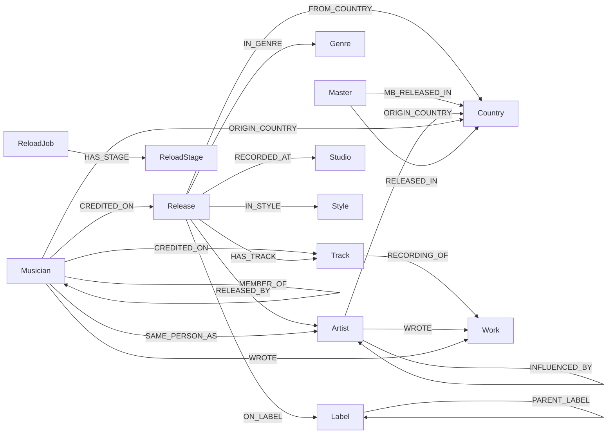

<!-- Auto-generated by `pnpm schema:diagram` from a live Neo4j introspection. Do not edit by hand. -->

# Data-model schema

> ⚠️ Generated by introspecting the live graph (ADR 0004). Until the schema-diagram
> workflow is wired up, this is a **manual point-in-time capture** — re-run
> `pnpm schema:diagram` to refresh. Node/relationship names and properties below
> are the authoritative model; the tables in the service handbook point here.

**Drift:** ⚠️ model changed vs last snapshot (1 label(s), 18 property(ies), 4 relationship(s)).

## Entity-relationship diagram

Each node label, its properties (`PK` = unique key), and the relationships
between them.

<!-- schema:er:start -->

```mermaid
%% Auto-generated by scripts/schema-diagram/generate.ts — do not edit by hand.
erDiagram
    Artist {
        StringArray awards
        String bornDate
        Long bornYear
        String diedDate
        Long diedYear
        Long discogsId PK
        StringArray genres
        String imageUrl
        StringArray influencedByQids
        String musicbrainzId "indexed"
        DateTime musicbrainzIdFetchedAt "indexed"
        String name "indexed"
        DateTime nationalityFetchedAt "indexed"
        StringArray playsInstrument
        StringArray playsInstrumentRaw
        String profile
        DateTime profileFetchedAt
        String realName
        StringArray styles
        DateTime wikidataFetchedAt "indexed"
        String wikidataQid "indexed"
    }
    Country {
        String name PK
    }
    Genre {
        String name PK
    }
    Label {
        Long discogsId PK
        DateTime labelHierarchyFetchedAt "indexed"
        String name
    }
    Master {
        Long discogsId PK
        DateTime mbReleaseEventsFetchedAt "indexed"
        String title
        Long year
    }
    Musician {
        Long discogsId "indexed"
        DateTime membersFetchedAt "indexed"
        String musicbrainzId "indexed"
        DateTime musicbrainzIdFetchedAt "indexed"
        String name "indexed"
        DateTime nationalityFetchedAt "indexed"
        Boolean notAGroup
    }
    Release {
        String barcode
        Double communityRating
        Long communityRatingCount
        Long discogsId PK
        String discogsUrl
        String format
        Boolean isVariousArtists
        Long masterDiscogsId
        DateTime masterFetchedAt "indexed"
        String notes
        Long originalYear
        Long pressingYear "indexed"
        String releaseDate
        String thumbUrl
        String title "indexed"
    }
    ReloadJob {
        DateTime completedAt
        Long durationMs
        String jobId PK
        DateTime startedAt "indexed"
        String status
    }
    ReloadStage {
        DateTime completedAt
        String countsJson
        String jobId "indexed"
        Long ordinal
        String stage
        DateTime startedAt
        String status
    }
    Studio {
        String name "indexed"
    }
    Style {
        String name PK
    }
    Track {
        Boolean acousticBrainzExhausted
        DateTime acousticBrainzFetchedAt "indexed"
        Double danceabilityEstimate
        Double deezerBpm
        DateTime deezerFetchedAt "indexed"
        Double deezerGain
        String duration
        Long durationSeconds
        Double dynamicComplexity
        Boolean isInstrumental
        String isrc "indexed"
        Double loudnessDb
        String lyrics "indexed"
        Double lyricsConfidence
        DateTime lyricsFetchedAt "indexed"
        String lyricsMatchedArtist
        String lyricsMatchedTitle
        String lyricsSource
        String lyricsStatus
        DateTime musicBrainzFetchedAt "indexed"
        String musicalKey
        String musicalScale "indexed"
        String position
        DateTime recordingArtistsFetchedAt "indexed"
        String recordingMbid "indexed"
        Long releaseDiscogsId
        Double tempo "indexed"
        String title "indexed"
        String voiceInstrumental
        DateTime worksFetchedAt "indexed"
    }
    Work {
        String mbid PK
        String title
        String type
        StringArray writerMbids
        StringArray writerRoles
        StringArray writers
    }
    Musician }o--o{ Release : "CREDITED_ON"
    Musician }o--o{ Track : "CREDITED_ON"
    Release }o--o{ Country : "FROM_COUNTRY"
    ReloadJob }o--o{ ReloadStage : "HAS_STAGE"
    Release }o--o{ Track : "HAS_TRACK"
    Artist }o--o{ Artist : "INFLUENCED_BY"
    Release }o--o{ Genre : "IN_GENRE"
    Release }o--o{ Style : "IN_STYLE"
    Master }o--o{ Country : "MB_RELEASED_IN"
    Musician }o--o{ Musician : "MEMBER_OF"
    Release }o--o{ Label : "ON_LABEL"
    Artist }o--o{ Country : "ORIGIN_COUNTRY"
    Musician }o--o{ Country : "ORIGIN_COUNTRY"
    Label }o--o{ Label : "PARENT_LABEL"
    Release }o--o{ Studio : "RECORDED_AT"
    Track }o--o{ Work : "RECORDING_OF"
    Release }o--o{ Artist : "RELEASED_BY"
    Master }o--o{ Country : "RELEASED_IN"
    Musician }o--o{ Artist : "SAME_PERSON_AS"
    Artist }o--o{ Work : "WROTE"
    Musician }o--o{ Work : "WROTE"
```

<!-- schema:er:end -->

## Graph overview

Labels as nodes, relationship types as edges — the at-a-glance shape of the graph.

<!-- schema:graph:start -->



<!-- schema:graph:end -->
